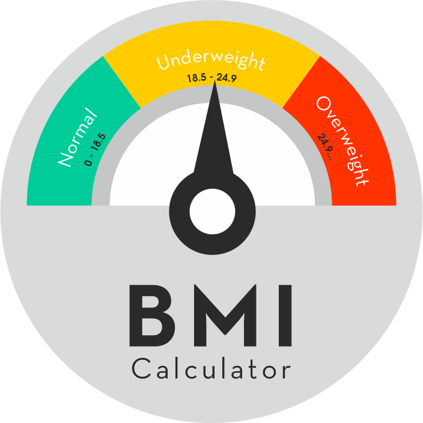

 
<h1 align="center">Kalkulator BMI </h1>

  

## Opis projektu 
  <a>Prosty kalkulator BMI w oparciu o technlogie klasyczne, HTML, CSS oraz JS</a>
  
## Screenshoty
    
  

    
  

## Użyte technologie/języki

| Technologia                                             | Zadanie                                  |
| ------------------------------------------------------- | ---------------------------------------- |
| [HTML](HTML)                        | Struktura całej strony |
| [CSS](CSS)                          | Odpowiada za szatę graficzną |
| [JS](JS)                            | Odpowiada za część skryptową |
